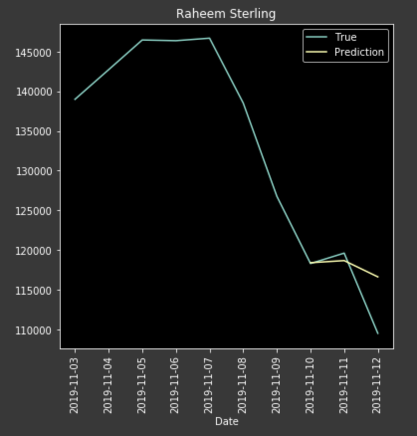
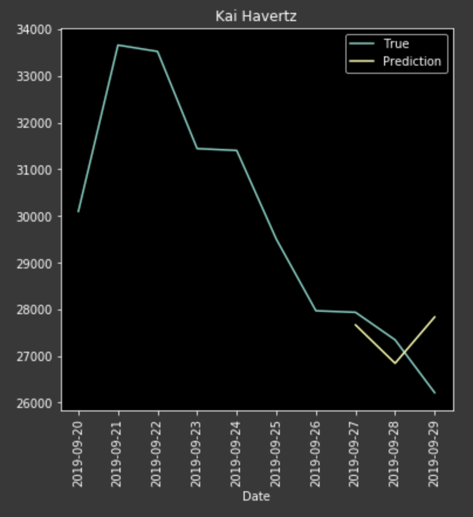
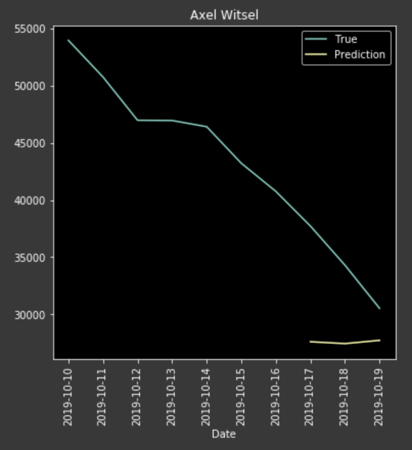

# FIFA - Player & Market Analysis

Analyzing player prices, attributes and statistics.

## Data Mining
Scraping the web to collect and store player attributes and prices into dataframes. The [update_full](https://github.com/cvaf/fut/blob/master/database/update_full.py) script provides scraping instructions - all relevant functions can be found in [update.py](https://github.com/cvaf/fut/blob/master/database/update.py).

## Modeling
The [pricey](https://github.com/cvaf/fut/tree/master/pricey) folder consists of two models used for forecasting the a player's price. The two models are very similar in how they treat each player's attributes but differ significantly in how they utilize temporal data. 
- [demon](https://github.com/cvaf/fut/blob/master/pricey/demon.ipynb): treats the past prices as "lag" features, along with all the other attributes. After trying out a variety of models (namely: RF, Elastic Net and DNN), the neural net seemed to be the best performer w/ the Elastic Net being a close second. The model seems to more or less capture price fluctuations but is in no way reliable unfortunately.
- [sophie](https://github.com/cvaf/fut/blob/master/pricey/sophie.ipynb): treats prices as temporal data and attributes as "non-temporal". The model infrastructure is as follows, the temporal data is fed into an LSTM while the attributes are fed into a dense layer. Their outputs are concatenated and later fed into more layers. The latest model was trained on FIFA 19 data to predict FIFA 20 prices.

#### To-do:

- [x] Train model
- [ ] Set-up prediction architecture
- [ ] Javascript model
- [ ] Set-up website

Following are a few example predictions from [sophie](https://github.com/cvaf/fut/blob/master/pricey/sophie.ipynb):

## Data Visualization (FIFA 19)

This [dashboard](https://fut-dash.herokuapp.com/) provides an interactive interface to view the relationship between Price and Performance. Code can be found in [dash_pgp.py](https://github.com/cvaf/fut/blob/master/dash_dataframes.py). Below is a screenshot of the dashboard. (Please note that it might take a few seconds to load)

