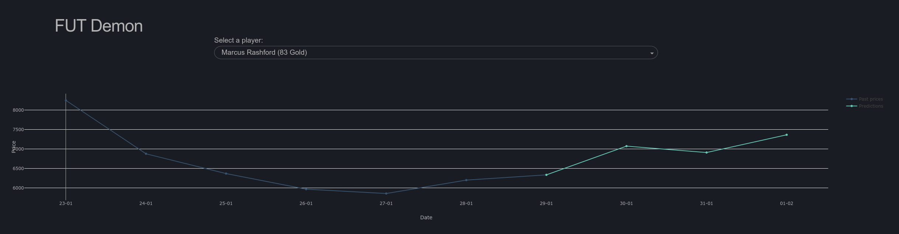

# FIFA20 - Market Analysis

## Data Mining

By scraping the web, we can collect and store player attributes and their prices into dataframes. This is done through the [update](https://github.com/cvaf/fut/blob/master/modules/update.py) script. You can run it with the following:

```bash
./demon.py --update 
```

## Processing

The [processing](https://github.com/cvaf/fut/blob/master/modules/preprocessing.py) module consists of functions that process the downloaded data and saves the output as numpy arrays in the [data](https://github.com/cvaf/fut/tree/master/data) folder. 

## Modeling

There are two notebooks in the [modules](https://github.com/cvaf/fut/tree/master/modules), each trains a model to forecasts a player's price. The two are very similar in how they treat each player's attributes but differ significantly in how they utilize temporal data. 

- [demon](https://github.com/cvaf/fut/blob/master/modules/demon.ipynb): treats the past prices as "lag" features, along with all the other attributes. After trying out a variety of models (namely: RF, Elastic Net and DNN), the neural net seemed to be the best performer w/ the Elastic Net being a close second. The model seems to more or less capture price fluctuations but is in no way reliable unfortunately.
- [sophie](https://github.com/cvaf/fut/blob/master/modules/sophie.ipynb): treats prices as temporal data and attributes as "non-temporal". Temporal data is fed into an LSTM while the attributes are fed into a dense layer. Their outputs are concatenated and later fed into more layers. 

One can train the latest sophie model using:

```bash
./demon.py --help

Options:
  --update      Fetch new players and prices
  --train       Train  the model
  --validation  Use a validation set
  --help        Show this message and exit.
```

## Evaluation

There's also an [evaluation](https://github.com/cvaf/fut/blob/master/modules/preprocessing.py) module, which evaluates a model's performance. This is done by grouping its predictions into bins and marking its accuracy. The results are also saved in the data folder as a pickle file. This file can be used to determine the model's reliability.

## Usage



Following are a few example predictions. (Step X means the prediction was generated X days before the day of interest). As expected, the higher the step number, the higher the error. 


#### To-do:

- [x] Train model
- [x] Set-up prediction architecture
- [x] Set-up website
- [x] Incorporate model evaluation and player reliability in the website
- [x] Switch to sqlite
- [ ] Add logging
- [ ] Fix model persistence
- [ ] Tweak feature engineering
