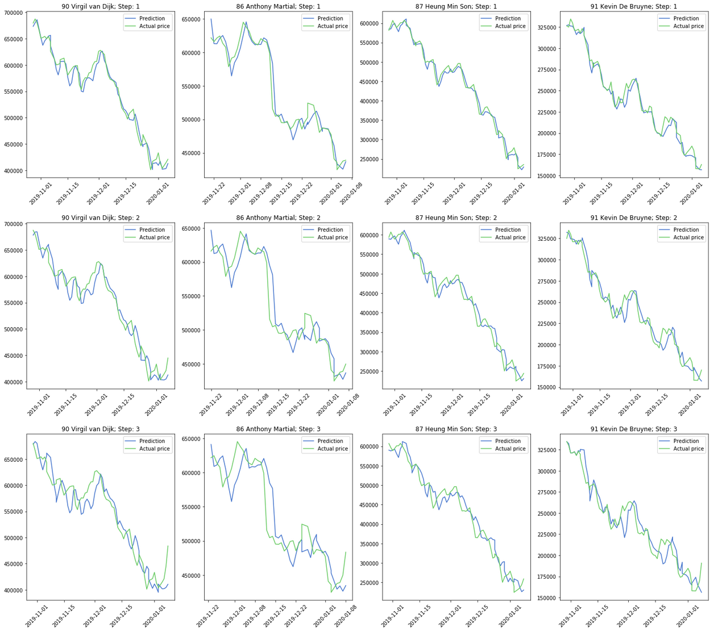

# FIFA20 - Market Analysis

## Data Mining

Scrapes the web to collect and store player attributes and prices into dataframes. The [update](https://github.com/cvaf/fut/blob/master/database/update.py) script provides scraping instructions. Run with:

```bash
python update.py y
```

Remove the trailing "y" to only fetch player attributes.

## Modeling

The [pricey](https://github.com/cvaf/fut/tree/master/pricey) folder consists of two models used for forecasting the a player's price. The two models are very similar in how they treat each player's attributes but differ significantly in how they utilize temporal data. 

- [demon](https://github.com/cvaf/fut/blob/master/pricey/demon.ipynb): treats the past prices as "lag" features, along with all the other attributes. After trying out a variety of models (namely: RF, Elastic Net and DNN), the neural net seemed to be the best performer w/ the Elastic Net being a close second. The model seems to more or less capture price fluctuations but is in no way reliable unfortunately.
- [sophie](https://github.com/cvaf/fut/blob/master/pricey/sophie.ipynb): treats prices as temporal data and attributes as "non-temporal". The model infrastructure is as follows, the temporal data is fed into an LSTM while the attributes are fed into a dense layer. Their outputs are concatenated and later fed into more layers. The latest model was trained on FIFA 19 data to predict FIFA 20 prices.

One can use the scripts to predict a player's prices as follows:

```bash
python prediction.py 100
```

where 100 is the player's ID. The model currently uses a player's prices in the past week, to predict their price over the next three days. 

Following are a few example predictions. (Step X means the prediction was generated X days before the day of interest). As expected, the higher the step number, the higher the error. 



#### To-do:

- [x] Train model
- [x] Set-up prediction architecture
- [ ] Javascript model
- [ ] Set-up website
